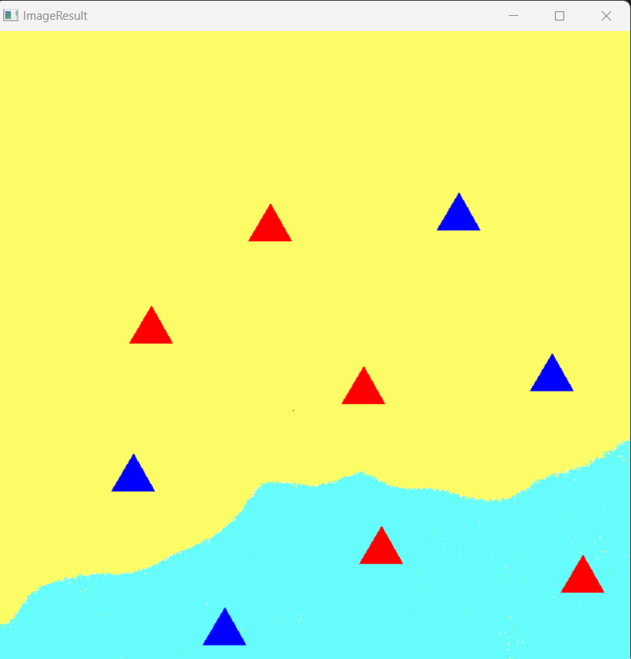
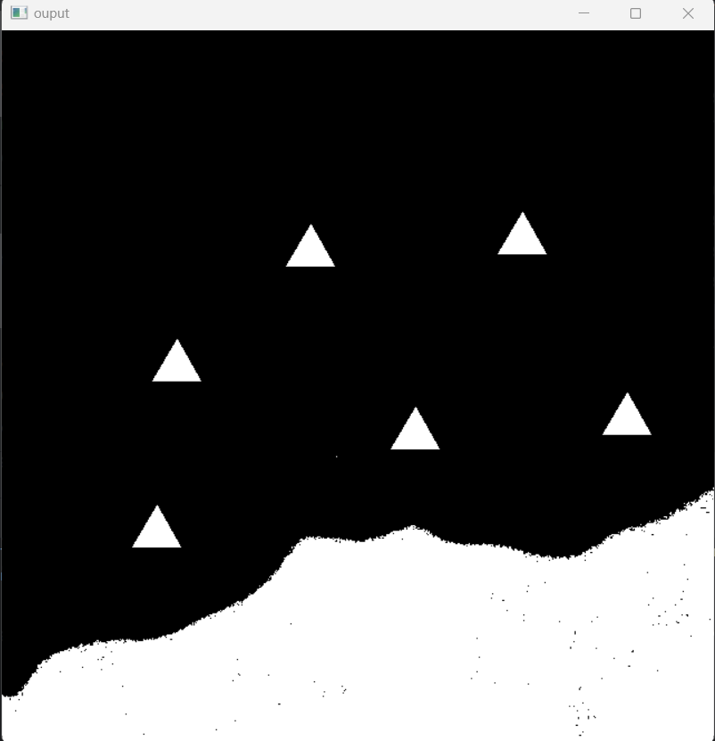
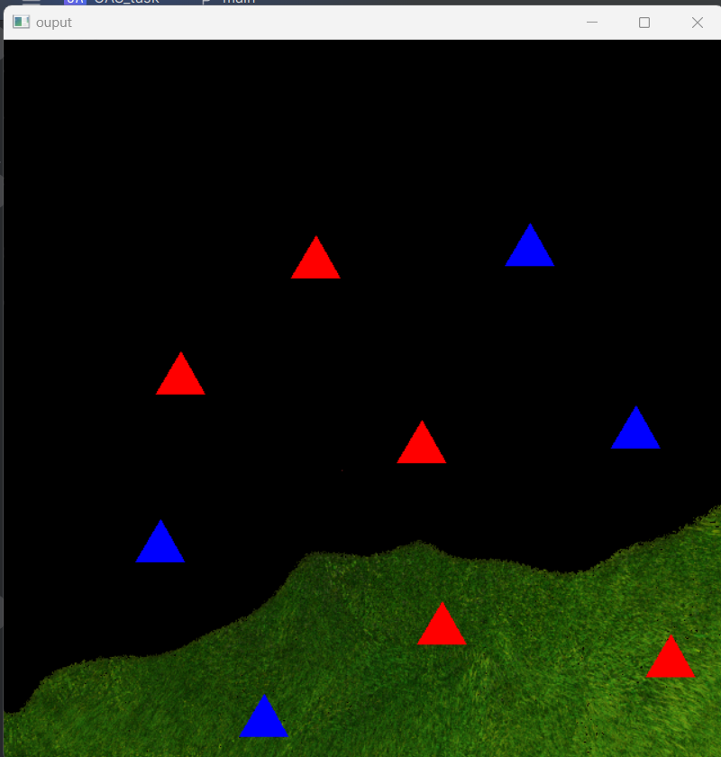

# UAS-DTU Round 2 task

**Name:** Abhay kumar<br>
**Roll no:** 24/B16/007

## Features

- **Detect triangles**: The program identifies triangular objects (like houses) in an image.
- **Color-based masking**: It creates masks for green grass and burnt regions using HSV color filtering.
- **Result visualization**: The output image highlights the grass, burnt regions, and detected triangles using color overlays.
- **House counting**: Counts the number of triangular objects in each region and prints the result.

## Prerequisites

- Python 3.x
- OpenCV 
- NumPy

To install the required packages, use:

```bash
pip install opencv-python 
```

## How It Works

1. **Image Input**: An input image is loaded and converted to HSV color space.
2. **Grass Masking**: A color range mask is applied to highlight green grass regions.
3. **Burnt Region Masking**: Another mask is applied to highlight the burnt regions.
4. **Triangle Detection**: Contours are extracted to detect triangles based on the number of vertices in the approximated shape.
5. **House Counting**: The number of triangles in each masked region is counted and displayed.
6. **Result Display**: The final result, including masked regions and triangles, is shown in a new window.

## Usage

1. Place the image in your working folder, and make sure the path is correct in the code:
   ```python
   inputImg = cv2.imread("image-location")
   ```
   
2. Run the Python script:
   ```bash
   python triangle_detection.py
   ```

3. The output will show:
   - The number of houses in burnt and green grass regions.
   - A result image with color overlays indicating grass, burnt regions, and triangles(Houses)
   - 

## Example Output

```
[[3 5]] (There are 3 houses on the burnt grass and 5 houses on the green grass)
```

The program will also open a window displaying the resultant image with color-coded regions and detected triangles.


## Code Explanation

### 1. **Loading the Image**
   The input image is loaded using OpenCV’s `cv2.imread()` function.

   ```python
   inputImg = cv2.imread("Resources/uas takimages/5.png")
   ```

### 2. **Converting Image to HSV**
   The image is converted from BGR to HSV color space using:
   ```python
   imgHSV = cv2.cvtColor(inputImg, cv2.COLOR_BGR2HSV)
   ```

### 3. **Creating Masks**

- **Grass Mask**:
   A mask is created for green grass areas using specific HSV color ranges, and a cyan overlay is applied to those regions.

   ```python
   grassMask = cv2.inRange(imgHSV, np.array([36, 108, 0]), np.array([117, 255, 255]))
   cyanMask[:] = [251, 252, 102]
   GrassMaskResult = cv2.bitwise_and(cyanMask, g_mask_bgr, mask=grassMask)
   ```

- **Burnt Region Mask**:
   A similar mask is created for burnt areas (reddish hues), with a yellow overlay applied.

   ```python
   burntMask = cv2.inRange(imgHSV, np.array([1, 108, 0]), np.array([36, 255, 255]))
   yellowMask[:] = [102, 252, 252]
   burntMaskResult = cv2.bitwise_and(yellowMask, mask_bgr, mask=burntMask)
   ```

### 4. **Detecting Triangles**

   The `get_num_triangle()` function is responsible for detecting and counting triangles (houses). It applies the following steps:
   
   - Blur the image to reduce noise.
   - Use Canny edge detection to find contours.
   - Approximate the contour shape and check if the shape is triangular (has 3 vertices).
   
   ```python
   def get_num_triangle(img):
       imgBlur = cv2.GaussianBlur(img, (7, 7), 1)
       imgCanny = cv2.Canny(imgBlur, 500, 500)
       contours, _ = cv2.findContours(imgCanny, cv2.RETR_EXTERNAL, cv2.CHAIN_APPROX_NONE)
       triangleCount = 0
       for cnt in contours:
           area = cv2.contourArea(cnt)
           if area > 500:
               peri = cv2.arcLength(cnt, True)
               approx = cv2.approxPolyDP(cnt, 0.02*peri, True)
               objNum = len(approx)
               if objNum == 3:
                   triangleCount += 1
       return triangleCount
   ```
### **What I was not able to do**
- Was unable to detect houses colour in each region
- 
- First I tried to separate triangles by taking their mask like this then by using `bitwise_and` I applied original image on this but this happened
- 
- We don't need the triangle on the grass
- I know I need to learn about contour, detect triangle and create their mask but... it way past 12 pm now.
- Because of this I was not able to achieve those task where I need to calculate priority